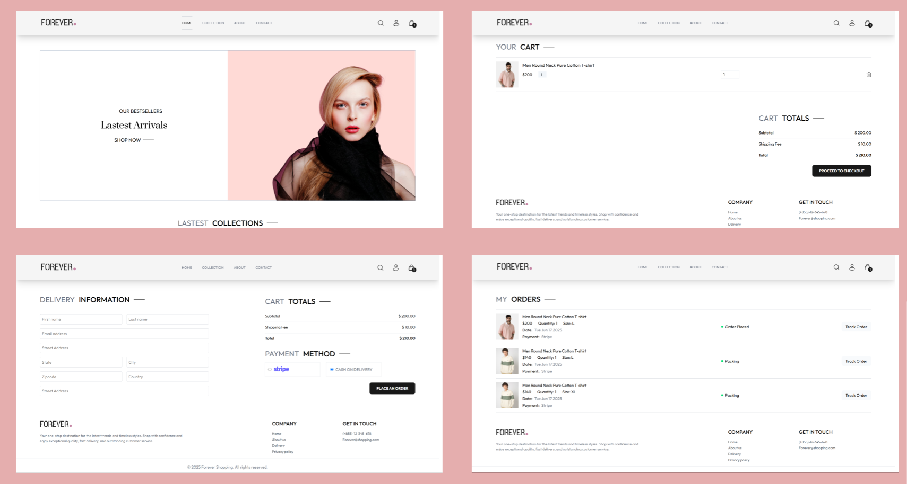

# E-Commerce Storefront (Front-end) 🛒

This repository contains the front-end source code for our MERN e-commerce platform. This client-facing application is built with React and Vite, offering a fast, responsive, and modern shopping experience for users.

---

## Key Features ✨

* **Dynamic Product Catalog**: Users can browse, search, and view details for all products available on the platform.
* **Interactive Shopping Cart**: A fully functional cart allows users to add, remove, and manage the items they wish to purchase.
* **User Authentication**: Secure user registration and login functionality to manage profiles and view order history.
* **Streamlined Checkout**: A simple and intuitive checkout process for a smooth purchasing experience.
* **Responsive Design**: A clean user interface built with **Tailwind CSS** that works seamlessly across desktops, tablets, and mobile devices.
* **User Feedback**: Clear and non-intrusive notifications for actions like "Item added to cart" powered by **React Toastify**.

---

## Tech Stack 🛠️

* **Library/Framework**: React
* **Build Tool**: Vite
* **Styling**: Tailwind CSS
* **Routing**: React Router DOM
* **HTTP Client**: Axios
* **Notifications**: React Toastify
* **State Management**: React Context API

---

## Getting Started 🚀

Follow these instructions to get a copy of the project up and running on your local machine for development and testing.

### Prerequisites

You'll need [Node.js](https://nodejs.org/en/) and [npm](https://www.npmjs.com/) installed on your machine.

### Installation

1.  **Clone the main project repository (if you haven't already):**
    ```bash
    git clone https://github.com/VannetNang/online-shopping.git
    cd online-shopping
    cd Front-end
    ```

2.  **Install all dependencies:**
    This command will install React and all other necessary libraries from the `package.json` file.
    ```bash
    npm install
    ```

3.  **Install frameworks / libraries:**
    ```bash
    npm install axios react-router-dom react-toastify tailwindcss @tailwindcss/vite
    ```

* In case, tailwindcss installation does not work: Go to this [TailwindCSS Installation](https://tailwindcss.com/docs/installation/using-vite)

4.  **Set up environment variables:**
    Create a `.env` file in the `Front-end` root directory. See the example section below for the required variables.

5.  **Start the development server:**
    This command starts the Vite development server.
    ```bash
    npm run dev
    ```
    The application will be accessible at `http://localhost:5173`

---

## Environment Variables (.env.example)

Create a `.env` file in the `Front-end` root directory. You must include the base URL for the backend API that this application will communicate with.

**Note:** Vite requires environment variables exposed to the browser to be prefixed with `VITE_`.

```env
# The base URL for your backend API
VITE_BACKEND_URL=http://localhost:8000