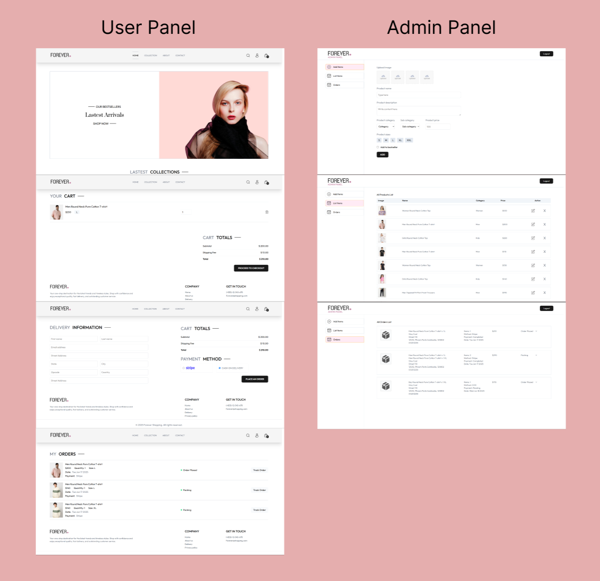

# Online Shopping Management System (MERN Stack)

## Project Overview

This is a MERN (MongoDB, Express.js, React.js, Node.js) stack application designed to manage an online shopping experience for a **single, dedicated online store**. The system provides a robust administrative dashboard for store owners/sellers to manage their product inventory and a user-friendly frontend for customers to browse, purchase, and manage their orders.

---

## Key Features

### User-Facing Features

* **Homepage Product Display:**
    * Browse all available products.
    * View detailed product information (images, description, price, availability) with or without an account.
* **Authentication & Authorization:**
    * User Sign-up and Login.
    * Password hashing (using bcrypt) for secure authentication.
    * JSON Web Tokens (JWT) for secure session management.
* **Shopping Cart Functionality:**
    * Add products to a persistent shopping cart (requires user login).
    * View, update quantities, and remove items from the cart.
* **Checkout Process:**
    * Secure checkout flow (integration with payment gateways like Stripe).
    * Order placement and confirmation.
* **User Dashboard:**
    * View order history.
* **Product Search & Filtering:**
    * Search for products by name, category, or keywords.
    * Filter products by price range, category, brand, etc.

### Admin Dashboard Features

* **Secure Admin Login:**
    * Dedicated login for store administrators/sellers.
    * Role-based access control (ensuring only authorized admins can access dashboard functionalities).
* **Product Management (CRUD):**
    * **Create:** Add new products to the store with details (name, description, price, category, images).
    * **Read:** View a list of all products.
    * **Update:** Edit existing product details. (not yet implemented!!!)
    * **Delete:** Remove products from the store.
* **Order Management:**
    * View all placed orders.
    * Update order status (e.g., Order Placed, Packing, Shipped, Out for delivery, Delivered).
    * View order details (items, customer info, shipping address).

---

## Technologies Used

### Frontend & Admin
* **React.js:** A JavaScript library for building user interfaces.
* **Vite:** A fast build tool for modern web projects.
* **React Router DOM:** For client-side routing.
* **Axios / Fetch API:** For making HTTP requests to the backend.
* **State Management:** (React Context API)
* **Styling:** (Tailwind CSS)

### Backend
* **Node.js:** JavaScript runtime environment.
* **Express.js:** Fast, unopinionated, minimalist web framework for Node.js.
* **MongoDB:** NoSQL database for storing application data.
* **Mongoose:** ODM (Object Data Modeling) library for MongoDB and Node.js.
* **bcrypt.js:** For hashing passwords.
* **jsonwebtoken:** For implementing JWT-based authentication.
* **dotenv:** For managing environment variables.
* **cors:** For handling Cross-Origin Resource Sharing.
* **multer:** For handling images.
* **cloudinary:** For uploading images from multer to the website.
* **Nodemon:** (Development dependency) For automatically restarting the server during development.
* **Stripe:** For handling online payment gateway.

### Deployment
* **Frontend:** Vercel
* **Backend:** Vercel
* **Admin:** Vercel
* **Database:** MongoDB Atlas

---

## Getting Started

Follow these instructions to set up and run the project locally.

### Prerequisites

* Node.js (LTS version recommended)
* npm (preferred package manager)
* MongoDB installed locally or access to a MongoDB Atlas cluster

### Installation

1.  **Clone the repository:**
    ```bash
    git clone https://github.com/VannetNang/online-shopping.git
    cd online-shopping
    ```

### Running the Application

* For deepen installation, you can check individual README.md in each folder directory.

1.  **Start the Backend Server:**
    ```bash
    cd Back-end
    npm run dev
    ```
    The backend server will typically run on `http://localhost:8000`.

2.  **Start the Frontend Development Server:**
    ```bash
    cd Front-end
    npm run dev
    ```
    The frontend development server will typically run on `http://localhost:5173`

3.  **Start the Admin Panel Server:**
    ```bash
    cd admin
    npm run dev
    ```
    The admin panel server will typically run on `http://localhost:5174`

---

## Contributing

We welcome contributions that add features or address anything currently lacking in the project! If you'd like to contribute, please follow these steps:

1.  **Fork the Project:**
    Click the 'Fork' button at the top right of the repository page to create your own copy.

2.  **Clone that Forked Repo:**
    ```bash
    git clone <URL.git>
    ```

3.  **Create your Feature Branch:**
    ```bash
    git checkout -b <branch-name>
    ```

4.  **Commit your Changes:**
    ```bash
    git add .
    git commit -m 'Add: Implement AmazingFeature'
    ```

5.  **Push to Your Branch:**
    ```bash
    git push origin <branch-name>
    ```

6.  **Open a Pull Request:**
    Go to the original project repository and you should see a prompt to create a Pull Request from your new branch. Click it, provide a clear title and description for your changes, and submit the Pull Request.

Your Pull Request will then be reviewed, and a decision will be made on whether to accept and merge the changes. We appreciate your efforts to improve the project!