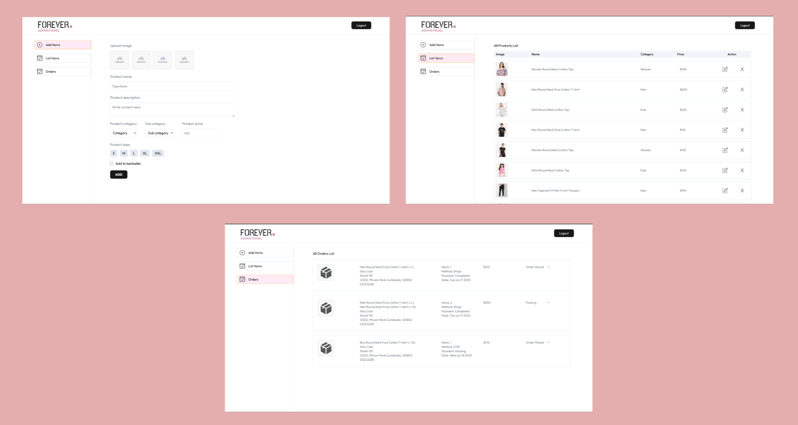

# E-Commerce Admin Panel 📈

This repository contains the frontend source code for the E-Commerce Admin Panel. It is a modern, responsive single-page application (SPA) built with React and Vite, designed to interact with the e-commerce backend API.

This panel provides administrators with a powerful and intuitive interface to manage products and view orders.

---

## Key Features ✨

* **Modern UI with Tailwind CSS**: A responsive and clean interface built using the utility-first Tailwind CSS framework.
* **Product & Order Management**: Full interfaces for administrators to perform CRUD (Create, Read, Update, Delete) operations on products and manage customer orders.
* **Client-Side Routing**: Seamless navigation between pages powered by **React Router DOM**.
* **API Integration**: Uses **Axios** to efficiently communicate with the backend REST API.
* **User-Friendly Notifications**: Provides clear feedback to the admin for various actions using **React Toastify**.
* **Built with Vite**: A fast and modern build tool for a superior development experience.

---

## Tech Stack 🛠️

* **Framework/Library**: React
* **Build Tool**: Vite
* **Styling**: Tailwind CSS
* **Routing**: React Router DOM
* **HTTP Client**: Axios
* **Notifications**: React Toastify

---

## Getting Started 🚀

Follow these instructions to get a copy of the project up and running on your local machine for development and testing.

### Prerequisites

You'll need [Node.js](https://nodejs.org/en/) and [npm](https://www.npmjs.com/) installed on your machine.

### Installation

1.  **Clone the repository:**
    ```bash
    git clone https://github.com/VannetNang/online-shopping.git
    cd online-shopping
    cd admin
    ```

2.  **Install NPM packages:**
    ```bash
    npm install
    ```

3.  **Install frameworks / libraries:**
    ```bash
    npm install axios react-router-dom react-toastify tailwindcss @tailwindcss/vite
    ```

* In case, tailwindcss installation does not work: Go to this [TailwindCSS Installation](https://tailwindcss.com/docs/installation/using-vite)

4.  **Set up environment variables:**
    Create a `.env` file in the root directory and add the necessary environment variables. See the example below.

5.  **Start the development server:**
    This command will start the Vite development server.
    ```bash
    npm run dev
    ```
    The admin panel will be accessible at `http://localhost:5174`

---

## Environment Variables (.env.example)

Create a `.env` file in the root directory. You must include the base URL for the backend API your admin panel will be making requests to.

**Note:** Vite requires environment variables exposed to the browser to be prefixed with `VITE_`.

```env
# The base URL for your backend API
VITE_BACKEND_URL=http://localhost:8000